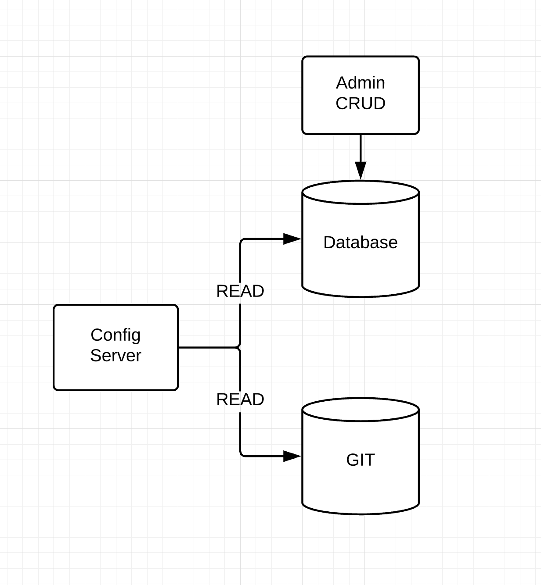

# Spring Cloud Config Server GIT & JDBC

This project contains configuration for config server to fetch configuration from GIT and JDBC.

###Why do we need this solution? 

In order to change common properties across all microservices sometimes will be hard to achieve because you need to modify all files for each env.

Example: if you want change URI database will be easier just change it through GUI. Instead of modify all files. 

## Prerequisites

You need to have database instance up and running. You can achieve this through docker or kubernetes.

###Docker 

You can use docker compose in this repo :

https://github.com/simon-atta/docker-compose/tree/master/mysql

###Kubernetes/Openshift

You can use helm chart in this repo: 

https://github.com/simon-atta/helm/tree/master/mysql

## Technologies

* Language: java
* Cloud: Spring cloud
